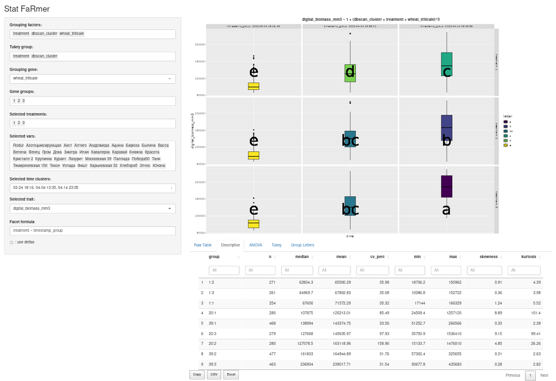

# StatFaRmer

## Overview
StatFaRmer is a tool developed to streamline the visualization of time series data generated by Phenospex and pinpoint outliers. The main focus is on simplifying routine analysis and conducting preliminary statistical tests on the collected data.


## Objectives
StatFaRmer aims to replicate methods from [this article](https://www.sciencedirect.com/science/article/pii/S0168945223000730) using Phenospex PlantEye observations and genetic data from the [groups.xlsx file](data/project_NO3/groups.xlsx) for further use in similar projects.

## Features



- **ANOVA Analysis**: ANOVA automatically includes all grouping factors and their interactions up to three-way. The Tukey group feature identifies which contrasts to examine within the ANOVA.
- **dbscan_cluster**: This feature serves as a substitute for timestamp data, enabling faceting and factor selection in the analysis.
- **Data subsetting**: Given grouping gene, selected treatments, selected cultivar and selected time clusters options, it is possible to test specific hypotheses for the given selected trait.
- **Table Download**: In StatFaRmer Shiny App, all tables can be easily downloaded after applying filters and subsets (via the Download Full Results button).
- **Facet Syntax**: The facet syntax aligns with R formula principles. You can position variables from the grouping factors list on either side of ~ to create vertically or horizontally distinct subplots; using *~ 1* removes faceting.

## Installation
To install StatFaRmer, run these commands in your terminal:

```bash
git clone https://github.com/Stathmin/StatFarmer
```

## Running Example
The initial run sets up the environment, creates necessary files, and launches the Shiny app:
```bash
Rscript main.R
```
After the first run, you can start the Shiny app separately with:
```bash
Rscript just_shiny.R
```

To explore the functionality of the Shiny Dashboard, navigate to the interactive example available [here](https://stathmin.shinyapps.io/StatFaRmer/).

## Customization
Users can upload their own projects to the data folder of StatFaRmer as long as their project adheres to the following conventions (see example - **project_NO3**):
- Includes an initial archived (.zip with .csv) Phenospex experiment
- Includes a *_handmade.csv table with mandatory **V.T.R**, **Treatment** (overrides Treatments in initial table), and **Cultivar** columns
- Includes a *_translation.csv table with mandatory **V.T.R** and **T:X:Y** columns
- Includes a groups.xlsx table with a mandatory **cultivar** column

Any additional columns from the last three tables are preserved and accessible for analysis as factors.

The user then can modify **project** and **hours_eps** variables at **main.R, lines 16-18** according to their project name and frequency of repeated measurements/table switches.

## Features
- In StatFaRmer Shiny App all the tables can be readily downloaded after any inputed filters and subsets (**Download Full Results** button).
- Facet syntax follows general principles of R formulas. Any variables from **Grouping factors:** list and their sums can be placed on any side of **~**, producing vertical or horizontal faceting of the plot, *~ 1* removes any faceting.
- ANOVA automatically includes all the grouping factors and their interactions, up-to three-way. Then Tukey group determines which contasts are to check for with the given ANOVA.
- **dbscan_cluster** is to be used as a standin for timestamp data both for faceting and factor selection.