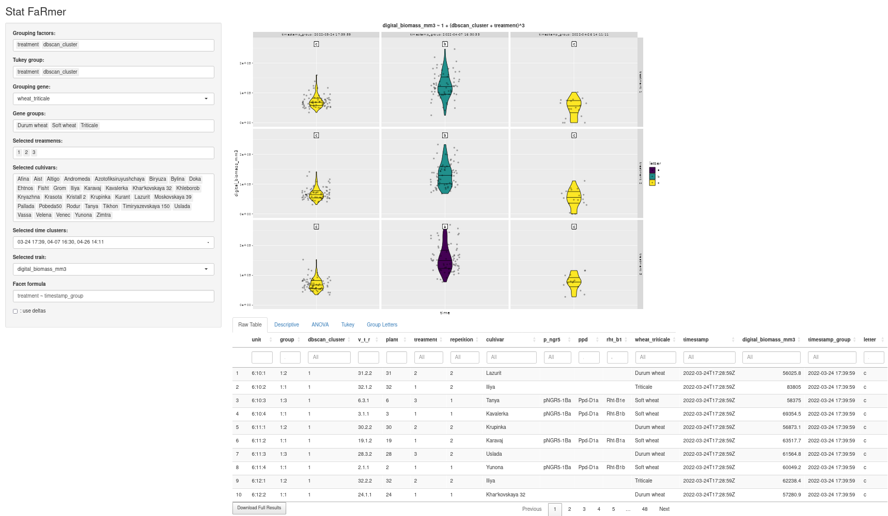

# StatFaRmer

## Overview
StatFaRmer is a tool developed to streamline the visualization of time series data generated by Phenospex and pinpoint outliers. The main focus is on simplifying routine analysis and conducting preliminary statistical tests on the collected data.


## Objectives
StatFaRmer aims to replicate the methods detailed in [this article](https://www.sciencedirect.com/science/article/pii/S0168945223000730) using a vast dataset of Phenospex PlantEye observations and a specific set of genetic factors delineated in the [groups.xlsx file](data/project_NO3/groups.xlsx).

## Installation
To install StatFaRmer, execute the following commands in your terminal:

```bash
git clone https://github.com/Stathmin/Wheat_Nitrates_2022
cd StatFaRmer
Rscript main.R
```

## Running Example
To explore the functionality of the Shiny Dashboard, navigate to the interactive example available [here](https://stathmin.shinyapps.io/StatFaRmer/).



## Customization
Users can upload their own projects to the data folder of StatFaRmer as long as they adhere to the following conventions:
- Include an initial archived (.zip with .csv) Phenospex experiment
- Provide a *_handmade.csv table with mandatory V.T.R, Treatment (overrides Treatments in initial table), and Cultivar columns
- Supply a *_translation.csv table with mandatory V.T.R and T:X:Y columns
- Include a groups.xlsx table with a mandatory cultivar column
- Any additional columns from the last three tables are preserved and accessible for analysis as factors.